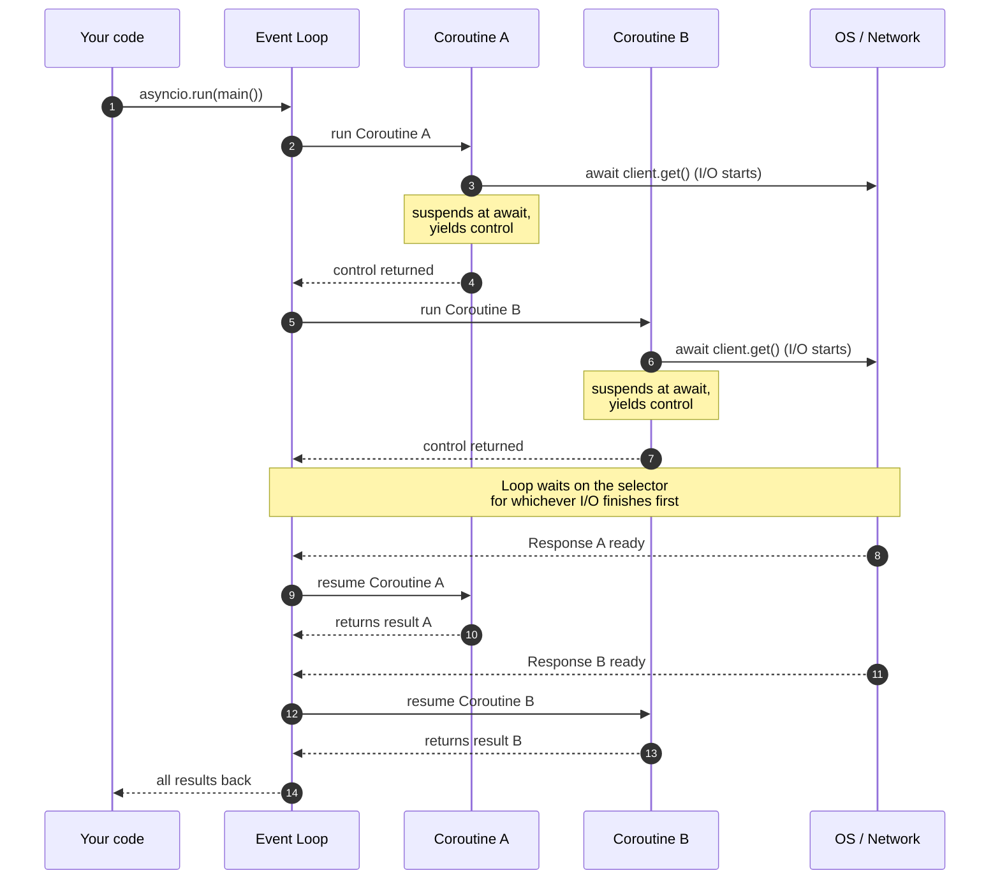

#### How `await` hands control back to the event loop

```mermaid
sequenceDiagram
    autonumber
    participant M as Your code
    participant L as Event Loop
    participant A as Coroutine A
    participant B as Coroutine B
    participant IO as OS / Network

    M->>L: asyncio.run(main())
    L->>A: run Coroutine A
    A->>IO: await client.get()  (I/O starts)
    Note over A: suspends at await,<br/>yields control
    A-->>L: control returned
    L->>B: run Coroutine B
    B->>IO: await client.get()  (I/O starts)
    Note over B: suspends at await,<br/>yields control
    B-->>L: control returned
    Note over L,IO: Loop waits on the selector<br/>for whichever I/O finishes first
    IO-->>L: Response A ready
    L->>A: resume Coroutine A
    A-->>L: returns result A
    IO-->>L: Response B ready
    L->>B: resume Coroutine B
    B-->>L: returns result B
    L-->>M: all results back
```

> `await` = "I'm blocked on something slow — **loop, go do other work and wake me when it's ready.**"
