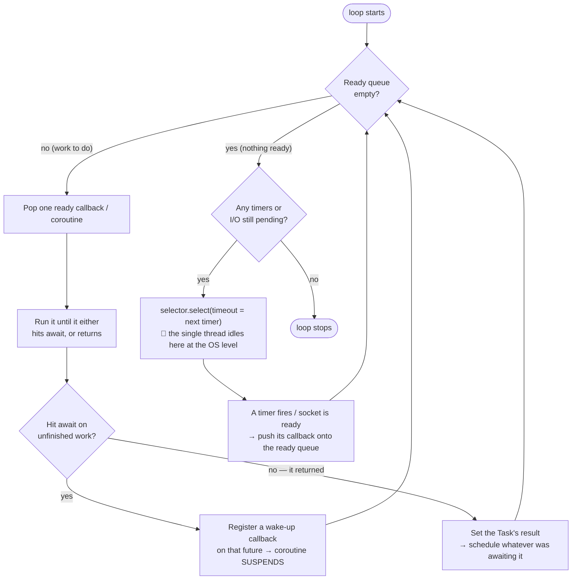

#### One tick of the event loop (what `run_until_complete` does in a cycle)

> The loop only ever does two things: **drain the ready queue**, then **sleep on the selector** until something becomes ready. Repeat.
