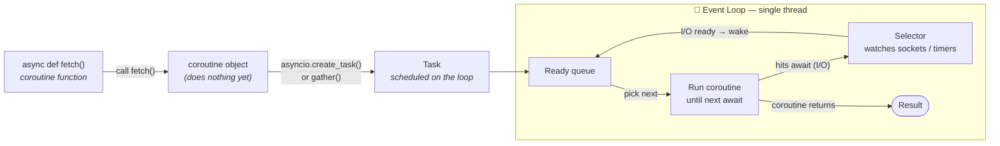

#### The moving parts: coroutine → task → event loop

```mermaid
flowchart LR
    CF["async def fetch()<br/><i>coroutine function</i>"] -->|"call fetch()"| CO["coroutine object<br/><i>(does nothing yet)</i>"]
    CO -->|"asyncio.create_task()<br/>or gather()"| TK["Task<br/><i>scheduled on the loop</i>"]

    subgraph LOOP["🔁 Event Loop — single thread"]
        direction TB
        RQ["Ready queue"] -->|"pick next"| RUN["Run coroutine<br/>until next await"]
        RUN -->|"hits await (I/O)"| SEL["Selector<br/>watches sockets / timers"]
        SEL -->|"I/O ready → wake"| RQ
        RUN -->|"coroutine returns"| RES(["Result"])
    end

    TK --> RQ
```

> You write **coroutines**. `asyncio` wraps them in **tasks** and the **event loop** juggles them, running each only up to its next `await`.
