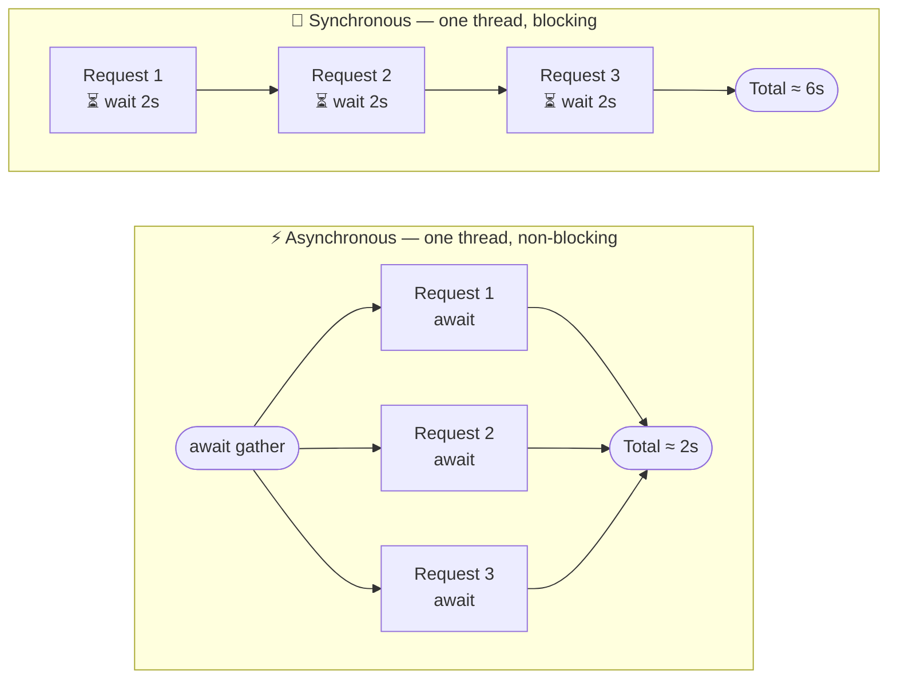

#### Blocking vs. Concurrent execution

```mermaid
flowchart TB
    subgraph SYNC["🐌 Synchronous — one thread, blocking"]
        direction LR
        S1["Request 1<br/>⏳ wait 2s"] --> S2["Request 2<br/>⏳ wait 2s"] --> S3["Request 3<br/>⏳ wait 2s"] --> STOTAL(["Total ≈ 6s"])
    end

    subgraph ASYNC["⚡ Asynchronous — one thread, non-blocking"]
        direction LR
        A0(["await gather"]) --> A1["Request 1<br/>await"]
        A0 --> A2["Request 2<br/>await"]
        A0 --> A3["Request 3<br/>await"]
        A1 --> ATOTAL(["Total ≈ 2s"])
        A2 --> ATOTAL
        A3 --> ATOTAL
    end

    SYNC ~~~ ASYNC
```

> Same single thread. The win is that **while one request waits on the network, the CPU starts the next one** instead of sitting idle.
